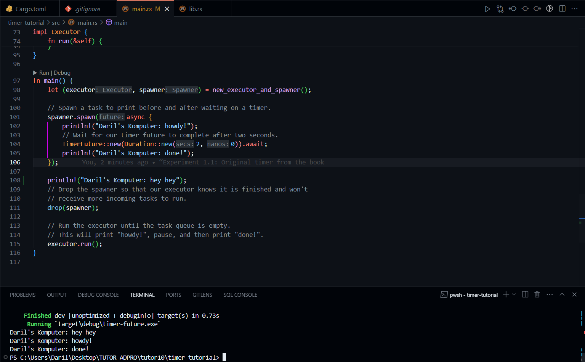
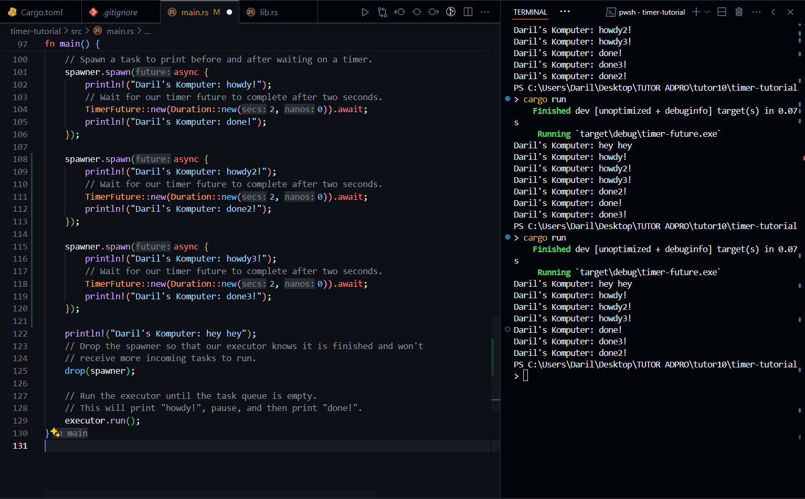
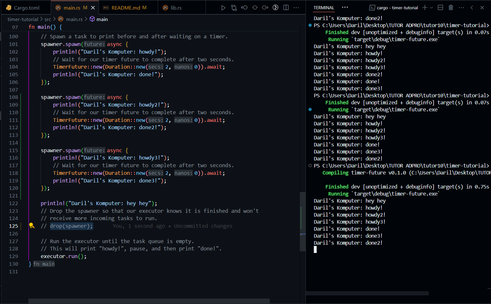

<h1>Understanding how it works</h1>

> The "Daril's Komputer: hey hey" line is executed first because it was out of the asynchronous scope.
> Meanwhile "Daril's Komputer: howdy!" and "Daril's Komputer: done!" lines executed after because it is waited first for the "hey hey" line.

<h1>Multiple Spawn and removing drop</h1>

- <h2>Multiple spawn with drop</h2>
  

> When we do multiple spawning, the order of the lines printed cant be determined accurately since it is ran asynchronously, but all it prints the "howdy" before the 2 seconds delay, and "done" after it.

- <h2>Multiple spawn without drop</h2>
  

> When we removed the drop spawner line, the program will keep running since it is waiting for the drop spawner to tells it to stop executing the program.
